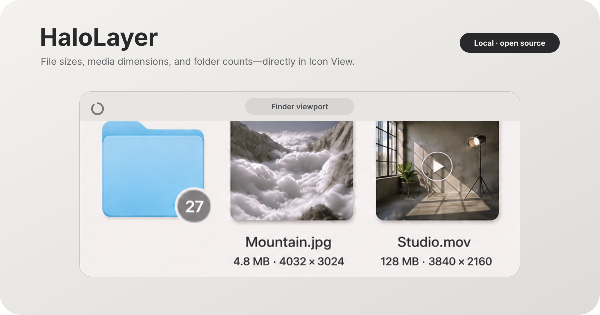

<div align="center">

# HaloLayer

**The missing metadata layer for Finder.**

File sizes, image and video dimensions, folder sizes, and subtle item-count badges—placed directly in Finder Icon View.

[](https://www.apple.com/macos/)
[](https://www.swift.org/)
[](LICENSE)
[](#project-status)

[Website preview](https://zenmaker-website-git-agent-halolayer-product-page-zenmaker.vercel.app/halolayer) · [Download app](https://github.com/thezenmaker/HaloLayer/releases/latest) · [Install](#installation) · [Privacy](PRIVACY.md) · [Contribute](CONTRIBUTING.md)

</div>



HaloLayer is a small native macOS menu-bar utility from [Johanna Zhou / ZenMaker](https://zenmaker.io). It makes Finder's Icon View more informative without turning file browsing into a dashboard—making complexity feel simple.

## What it adds

- File and recursive folder sizes
- Image and video resolution
- Immediate folder-item counts in circular badges
- Independent menu-bar toggles for size, resolution, and folder badges
- Overlay clipping to the active Finder viewport
- Fast position updates while scrolling and automatic hiding behind other windows

Everything runs locally. HaloLayer does not require an account or transmit file names, file contents, folder paths, or usage data.

## Installation

HaloLayer is not yet signed or notarized with a paid Apple Developer certificate. Choose the path that fits you.

### For normal users — download the unsigned app

Download `HaloLayer-v0.1.1-macos-universal.zip` from the **Assets** section of the [latest GitHub Release](https://github.com/thezenmaker/HaloLayer/releases/latest), unzip it, and move `HaloLayer.app` to Applications. Xcode and an Apple Developer account are not required. This universal preview build supports Apple Silicon and Intel Macs.

> Do not choose GitHub's automatically generated **Source code (zip)** or use **Code → Download ZIP** unless you want the source files. Those downloads do not contain the ready-to-run app.

Because the app is unsigned and not notarized, macOS will probably block the first launch. If—and only if—you downloaded it from this official repository, try to open HaloLayer once, then open **System Settings → Privacy & Security**, find the HaloLayer message, and choose **Open Anyway**. This approves this app only; do not disable Gatekeeper globally.

HaloLayer requires Accessibility access to position metadata beside visible Finder icons. The source is public so you can inspect what that permission is used for before installing.

> The ZIP is the recommended format for this early preview. A DMG would add a more polished drag-to-Applications presentation, but it would not remove the warning from an unsigned and unnotarized app.

### For developers — build from source with free Xcode

You only need a Mac, Xcode, and a free Apple ID.

```bash
git clone https://github.com/thezenmaker/HaloLayer.git
cd HaloLayer
open HaloLayer.xcodeproj
```

In Xcode, select the **HaloLayer** scheme and press **Run**. If Xcode asks for a team, choose your Personal Team under **Signing & Capabilities**. A paid Apple Developer membership is not required for a local build.

## First launch

1. Open HaloLayer; its status indicator appears in the menu bar.
2. Grant **Accessibility** access when requested so HaloLayer can locate visible Finder icons.
3. Allow Finder automation if macOS asks; this lets HaloLayer identify the open folder and view mode.
4. Open a Finder window in **Icon View** and use the menu-bar toggles to choose what appears.

After replacing or rebuilding the app, macOS may treat it as a new binary and ask you to re-enable Accessibility access.

After macOS allows the app and HaloLayer opens, the guided setup assistant appears automatically. It explains the permission, opens the correct Accessibility settings pane, detects when access is granted, opens Finder, and shows where to control each layer. You can reopen it later from **Getting Started…** in the halo menu.

## Privacy and permissions

HaloLayer reads Finder window geometry and local file metadata solely to draw its overlays. It does not transmit file names, file contents, folder paths, metadata, or usage data. The app uses:

- **Accessibility** to read visible Finder item positions
- **Finder automation** to identify the active folder and confirm Icon View
- **Local filesystem metadata** to calculate sizes, dimensions, and folder counts

See the complete, plain-language [privacy statement](PRIVACY.md).

## How it works

HaloLayer is one native AppKit application with two coordinated visual layers:

```text
Finder Icon View
      │
      ├── Metadata layer ── size · resolution · recursive folder size
      └── Badge layer ───── immediate folder item count
```

The overlays are click-through, clipped to the active Finder content area, and ordered relative to that Finder window. No Finder Sync extension is embedded.

## Development

The application stays in Swift/AppKit because it integrates directly with macOS Accessibility, Finder automation, ImageIO, and AVFoundation.

```bash
# Build and run tests through Swift Package Manager
swift build
swift test

# Or build the app target with Xcode
xcodebuild -project HaloLayer.xcodeproj -scheme HaloLayer -configuration Debug build
```

See [MANUAL_TESTS.md](MANUAL_TESTS.md) for Finder-specific verification that cannot be covered reliably by unit tests.

## Project status

HaloLayer is an early preview with these current limitations:

- macOS 14 or later is required.
- Icon View is the supported layout; List, Column, and Gallery views are intentionally left untouched.
- Finder's Accessibility hierarchy is not a public overlay API and can change between macOS versions.
- Unsigned builds may require Accessibility permission to be granted again after rebuilding or replacing the app.

## About

Built by [Johanna Zhou / ZenMaker](https://zenmaker.io)—designing tools that make complexity feel simple.

HaloLayer remains fully functional without visiting the website.

HaloLayer is an independent open-source project and is not affiliated with or endorsed by Apple Inc. macOS and Finder are trademarks of Apple Inc.

## More tools

Explore more work from [ZenMaker](https://zenmaker.io).

## License

HaloLayer is available under the [MIT License](LICENSE).
